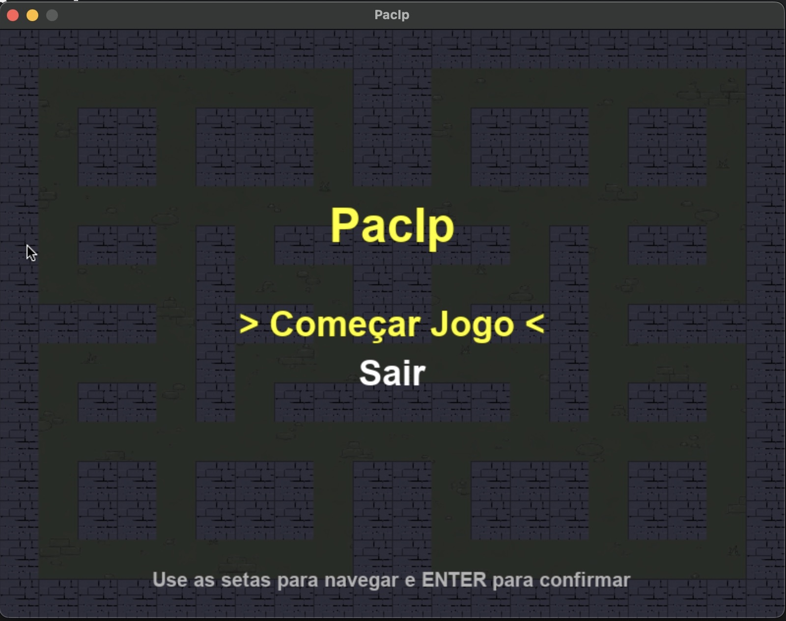
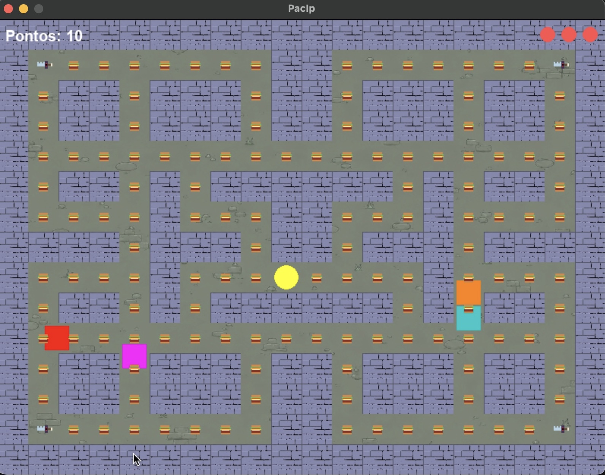
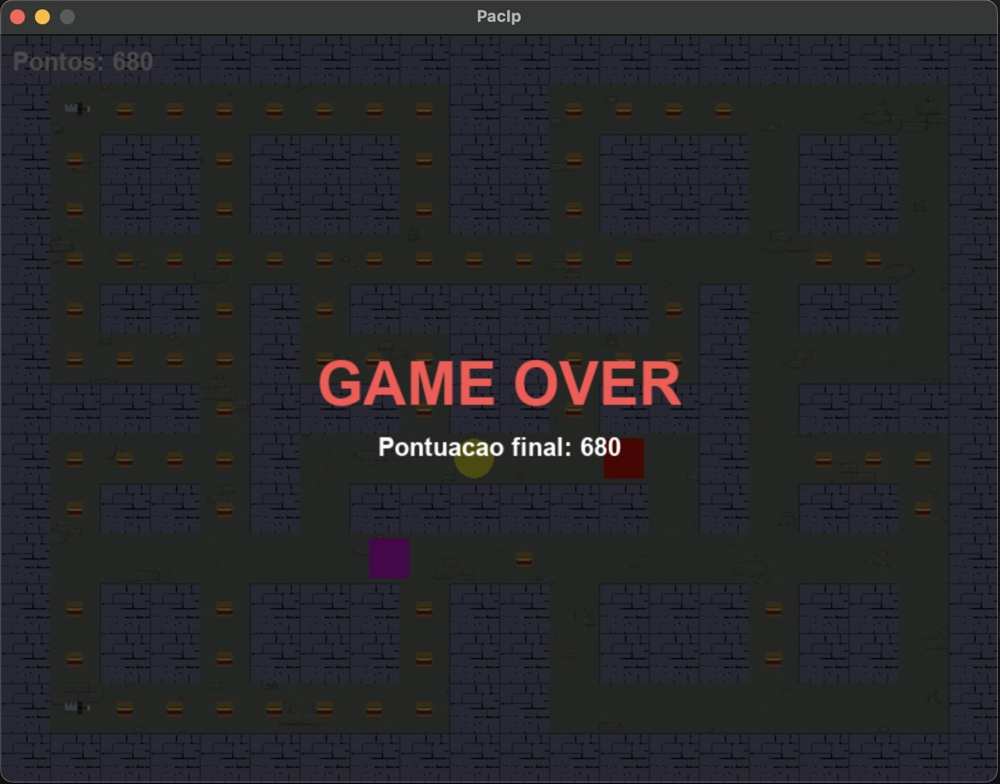
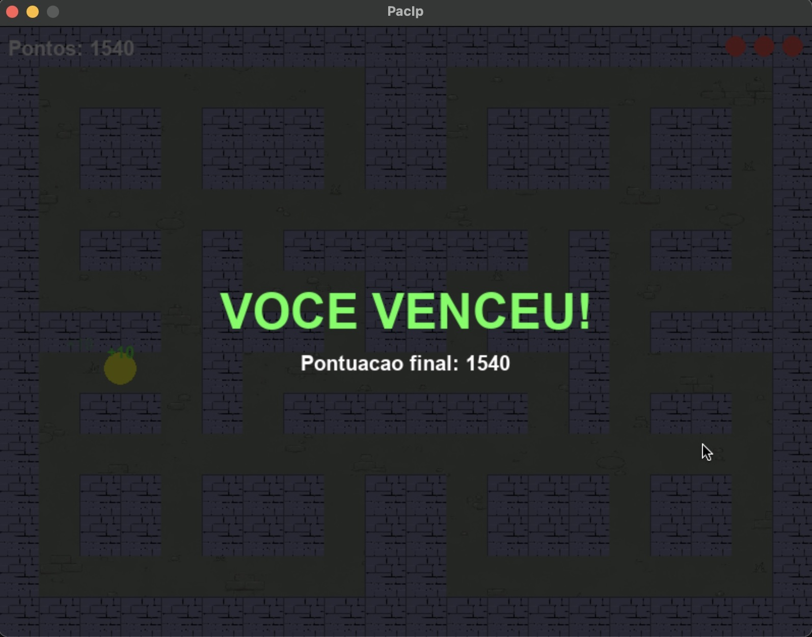

# PacIp

Projeto desenvolvido para a disciplina de **Introdução à Programação** (2026.1).

O **PacIp** é uma releitura do clássico **Pac-Man**, desenvolvido em **Python** utilizando a biblioteca **Pygame**.

---

# 🎮 Como Jogar

### Controles

- ⬆️⬇️⬅️➡️ **Setas direcionais:** movimentam o PacIp.

### Objetivo

- Colete todos os hambúrgueres espalhados pelo mapa;
- Encontre todas as espadas;
- Derrote todos os fantasmas para vencer a partida.

---

# 🛠️ Instalação

### 1. Clone o repositório

```bash
git clone https://github.com/ericsalmeida/projetoIP.git
```

### 2. Acesse a pasta do projeto

```bash
cd projetoIP
```

### 3. Crie um ambiente virtual

**Windows**

```bash
python -m venv venv
```

**Linux / macOS**

```bash
python3 -m venv venv
```

### 4. Ative o ambiente virtual

**Windows**

```bash
venv\Scripts\activate
```

**Linux / macOS**

```bash
source venv/bin/activate
```

### 5. Instale as dependências

```bash
pip install -r requirements.txt
```

### 6. Execute o jogo

```bash
python main.py
```

---

# 👥 Equipe

- Dimitri Juliano
- Efraim Negreiros
- Eric Almeida
- Gabriel Freitas
- Miguel
- Thiago

---

# 📂 Estrutura do Projeto

```
.
├── .gitignore              # Arquivos ignorados pelo Git
├── README.md               # Documentação do projeto
├── requirements.txt        # Dependências do projeto
├── main.py                 # Ponto de entrada da aplicação
├── constants.py            # Constantes do jogo
│
├── assets/
│   ├── images/             # Sprites e imagens
│   ├── sounds/             # Efeitos sonoros e música
│   └── screens/            # Capturas de tela
│
└── classes/
    ├── Coin.py             # Classe das moedas
    ├── FloatingText.py     # Textos flutuantes de pontuação
    ├── Game.py             # Loop principal e gerenciamento do jogo
    ├── Ghost.py            # Classe dos fantasmas
    ├── Key.py              # Classe das espadas
    ├── Life.py             # Classe das vidas
    ├── Map.py              # Construção do mapa
    └── PacIp.py            # Classe do jogador
```

---

# ✅ Divisão de Tarefas

| Integrante | Responsabilidades |
|------------|-------------------|
| **Dimitri Juliano** | Classe `Game` e Classe `Ghost` |
| **Efraim Negreiros** | Classe `PacIp` e Classe `Game` |
| **Eric Almeida** | Classe `Key` |
| **Gabriel Freitas** | Classe `Ghost` e Classe `Life` |
| **Miguel** | Classe `Map` |
| **Thiago** | Classe `Coin` e Sprites |

---

# 📈 Desafios e Aprendizados

Durante o desenvolvimento do projeto, enfrentamos diversos desafios importantes.

- Aprender a utilizar a biblioteca **Pygame**, compreendendo seu funcionamento, renderização de elementos gráficos e gerenciamento do loop principal do jogo.

- Aplicar os conceitos de **Programação Orientada a Objetos (POO)** para estruturar o projeto em classes independentes e reutilizáveis.

- Modularizar o sistema, separando responsabilidades em diferentes arquivos para facilitar a manutenção e o desenvolvimento em equipe.

- Gerenciar corretamente a comunicação entre as diferentes classes do jogo, garantindo que todos os componentes funcionassem de forma integrada.

- Desenvolver habilidades de trabalho em equipe, organização e divisão de tarefas utilizando Git e GitHub.

---

# 🕹️ Capturas de Tela

## Menu Principal



---

## Jogo



---

## Game Over



---

## Vitória


